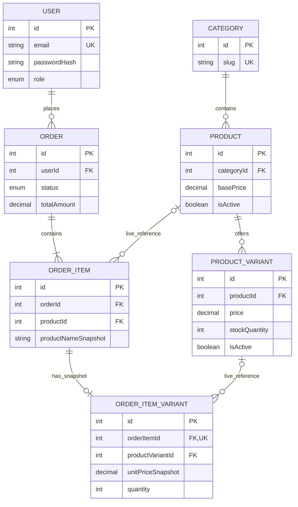
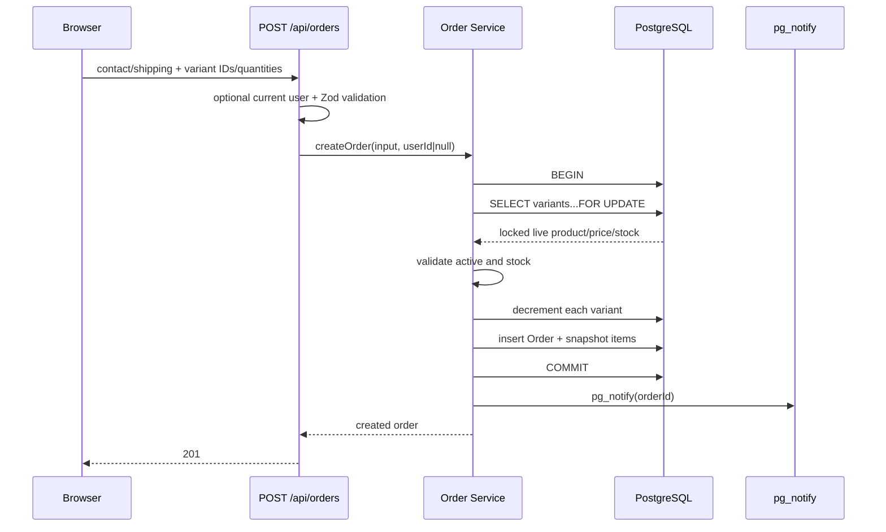
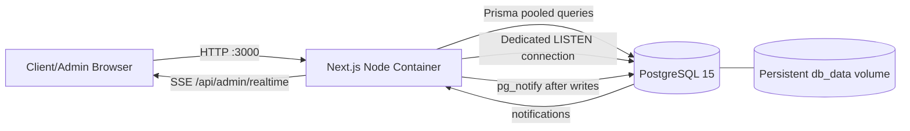

# Current Architecture Audit and Target Architecture

**Audit timestamp:** 2026-07-16 15:59 (Africa/Nouakchott)  
**Repository:** `Ecommece-website`  
**Method:** Read-only source, configuration, migration, and documentation inspection

## Table of Contents

1. [Executive Summary](#1-executive-summary)
2. [Scope and Method](#2-scope-and-method)
3. [Repository Overview](#3-repository-overview)
4. [Actual Technology Stack](#4-actual-technology-stack)
5. [Runtime Components](#5-runtime-components)
6. [Current Project Structure](#6-current-project-structure)
7. [Frontend Architecture](#7-frontend-architecture)
8. [Backend Architecture](#8-backend-architecture)
9. [API Inventory](#9-api-inventory)
10. [Authentication and Authorization](#10-authentication-and-authorization)
11. [Database Architecture](#11-database-architecture)
12. [Entity Relationship Diagram](#12-entity-relationship-diagram)
13. [Business Rules](#13-business-rules)
14. [Order and Inventory Workflows](#14-order-and-inventory-workflows)
15. [Realtime Architecture](#15-realtime-architecture)
16. [External Services](#16-external-services)
17. [Security Findings](#17-security-findings)
18. [Reliability and Performance](#18-reliability-and-performance)
19. [Testing and Quality Controls](#19-testing-and-quality-controls)
20. [Deployment Architecture](#20-deployment-architecture)
21. [Documentation Versus Implementation](#21-documentation-versus-implementation)
22. [Architecture Strengths](#22-architecture-strengths)
23. [Architecture Weaknesses](#23-architecture-weaknesses)
24. [Risks and Technical Debt](#24-risks-and-technical-debt)
25. [Architecture Scorecard](#25-architecture-scorecard)
26. [Recommended Target Architecture](#26-recommended-target-architecture)
27. [Incremental Migration Plan](#27-incremental-migration-plan)
28. [Open Questions](#28-open-questions)
29. [Final Prioritized Recommendations](#29-final-prioritized-recommendations)
30. [Evidence Appendix](#30-evidence-appendix)

## 1. Executive Summary

The repository is a **single-deployable modular monolith** built with Next.js 14 App Router. Storefront pages, admin pages, HTTP API route handlers, business services, Prisma data access, and a server-hosted realtime bridge all live in one application. PostgreSQL is the only required external stateful service.

The platform currently implements:

- client registration, login, logout, and cookie-based JWT sessions;
- public product/category browsing, search, pagination, variants, and local browser cart;
- guest and authenticated cash-on-delivery checkout;
- server-authoritative price calculation and transactional stock decrement;
- authenticated order history, order detail, and owner-only Pending cancellation;
- admin product, variant, category, client, order, and analytics interfaces;
- admin-only realtime order refresh through PostgreSQL `LISTEN/NOTIFY`, Server-Sent Events (SSE), and React Query invalidation;
- Docker-based app/PostgreSQL operation and a documented, but unproven, Vercel deployment path.

The implementation is more robust than the old design in one important area: checkout locks variant rows and status changes lock order rows, preventing ordinary concurrent overselling and double stock restoration (`src/services/inventory.service.ts:45`, `src/services/order.service.ts:43`).

The highest-priority defects are:

1. **Duplicate variant lines can oversell stock.** Checkout validates each repeated line against the same locked starting quantity rather than validating the aggregate quantity, and the database has no non-negative stock constraint (`src/lib/validators.ts:61`, `src/services/inventory.service.ts:63`).
2. **A realtime notification failure occurs after commit but is returned as checkout failure.** The order and stock transaction may succeed, then `pg_notify` may fail, producing a 500 and encouraging a duplicate retry; no idempotency key prevents duplicate orders (`src/services/order.service.ts:50`, `src/services/order.service.ts:93`).
3. **Admin order lifecycle rules contradict the documented state machine.** The implementation permits every status to transition to every other status, including reopening terminal orders, while the specifications define forward-only transitions and terminal Cancelled/Returned states (`src/constants/order-status.ts:42`, `src/services/order.service.ts:200`).

Other material gaps include no login/registration rate limiting, no automated tests, no health route, no application health check, no image-upload integration, unbounded admin order/client reads, incomplete account management, and a realtime implementation incompatible with the documented Vercel serverless model.

## 2. Scope and Method

### Scope

The scan covered:

- all tracked source files under `src/`;
- Prisma schema, migration, and seed;
- root build, lint, formatting, TypeScript, Docker, Compose, and Make configuration;
- hidden configuration including `.env.example`, `.gitignore`, ESLint, and Prettier;
- `README.md` and all documents under `docs/`;
- package metadata and lockfile presence;
- route, service, authorization, data, and deployment boundaries.

Generated and dependency directories were excluded. `.env.local` was identified but not read or printed.

### Validation commands

| Check                             | Result                                                                                             |
| --------------------------------- | -------------------------------------------------------------------------------------------------- |
| `npm run lint`                    | Passed: no ESLint warnings or errors                                                               |
| `npx tsc --noEmit --pretty false` | Passed                                                                                             |
| `npm run format:check`            | Failed: pre-existing formatting differences in `README.md` and `src/services/inventory.service.ts` |
| Tests                             | Not run: no test files or test script exist                                                        |
| Production build                  | Intentionally not run because it writes `.next`, contrary to the read-only audit constraint        |
| Database/integration execution    | Not run; it would require live infrastructure and could mutate data                                |

### Classification vocabulary

- **Implemented:** supported by executable code.
- **Partially implemented:** core behavior exists but meaningful scope is absent or inconsistent.
- **Documented but not implemented:** described in docs without supporting implementation.
- **Implemented but not documented:** executable behavior absent from or materially different from docs.
- **Contradictory:** implementation and documentation assert incompatible behavior.
- **Unclear:** repository evidence is insufficient to confirm production behavior.

## 3. Repository Overview

### Architecture classification

This is not a monorepo, separate frontend/backend system, microservice system, or purely serverless application. It is a **single-package TypeScript modular monolith**:

- one root `package.json`;
- one Next.js application;
- API endpoints under `src/app/api`;
- page routes under `src/app`;
- shared service layer under `src/services`;
- one Prisma schema and one PostgreSQL database;
- one application container exposing port 3000.

The storefront and admin dashboard are presentation boundaries, not separately deployed applications. The API and UI share a process and may share service imports; several Server Components call services/database-backed functions directly (`src/app/(client)/products/page.tsx`, `src/app/admin/products/[id]/page.tsx`).

### Important tree

```text
.
├── docs/                         intended architecture and interface specifications
├── prisma/
│   ├── migrations/               one initial PostgreSQL migration
│   ├── schema.prisma             executable database model
│   └── seed.ts                   destructive development seed
├── public/                       static assets; currently effectively empty
├── src/
│   ├── app/
│   │   ├── (auth)/               login and registration pages
│   │   ├── (client)/             storefront, cart, checkout, account, orders
│   │   ├── admin/                admin dashboard and management pages
│   │   └── api/                  HTTP route handlers
│   ├── components/               feature and UI components
│   ├── constants/                order status display/transition constants
│   ├── hooks/                    auth, cart, realtime client hooks
│   ├── lib/                      auth, database, errors, validation, realtime plumbing
│   ├── services/                 business and persistence operations
│   └── types/                    API/UI DTO-like types
├── Dockerfile                    production-style Node container
├── Dockerfile.dev                bind-mounted development container
├── docker-compose.yml            app + PostgreSQL
├── docker-compose.dev.yml        development override
├── Makefile                      container lifecycle shortcuts
├── next.config.mjs               empty Next.js config
├── package.json                  single application manifest
└── tsconfig.json                 strict TypeScript configuration
```

Empty `src/styles`, `src/utils`, `src/constants/.gitkeep`, and `src/lib/helpers` structures indicate template residue. The actual structure is generally understandable, but it contradicts `docs/project-structure.md`, which explicitly says no separate `src/utils/` directory should exist.

## 4. Actual Technology Stack

| Area                           | Technology                                                               | Purpose and evidence                                        | Status                                                      |
| ------------------------------ | ------------------------------------------------------------------------ | ----------------------------------------------------------- | ----------------------------------------------------------- |
| Frontend                       | Next.js 14.2 App Router, React 18, TypeScript                            | Routes/layouts in `src/app`; strict TS in `tsconfig.json`   | Active                                                      |
| Backend                        | Next.js Route Handlers on Node/Edge middleware                           | API under `src/app/api`; middleware in `src/middleware.ts`  | Active                                                      |
| Styling                        | Tailwind CSS 3, plain component classes                                  | `tailwind.config.ts`, `src/app/globals.css`                 | Active                                                      |
| UI library                     | Small local primitives inspired by shadcn patterns                       | `src/components/ui`; no shadcn package/config               | Partial; README overstates “shadcn/ui”                      |
| Client server-state            | TanStack React Query 5                                                   | `QueryProvider`, page queries, cache invalidation           | Active                                                      |
| Local state                    | React Context/reducer and component state                                | cart provider and forms                                     | Active                                                      |
| Form handling                  | Hand-written controlled forms                                            | login/register/product/checkout components                  | Active; no form library                                     |
| Validation                     | Zod 4 on API; manual browser validation                                  | `src/lib/validators.ts`; component validation               | Active                                                      |
| Authentication                 | Custom JWT (HS256) + bcryptjs + HTTP-only cookie                         | `jwt.ts`, `password.ts`, `auth-cookie.ts`                   | Active                                                      |
| Authorization                  | DB-resolved user plus `requireUser`/`requireAdmin`; Edge page middleware | guards and `src/middleware.ts`                              | Active, with page-layer caveats                             |
| Database                       | PostgreSQL 15+                                                           | Prisma datasource and Compose image                         | Active                                                      |
| ORM/query                      | Prisma 6 plus parameterized raw SQL                                      | CRUD plus row locks/date aggregation                        | Active                                                      |
| Realtime                       | PostgreSQL `LISTEN/NOTIFY` + SSE + EventSource                           | `src/lib/realtime`, admin realtime route/hook               | Active only on long-lived Node                              |
| Charts                         | Recharts                                                                 | admin analytics                                             | Active                                                      |
| Images                         | External URL strings and plain ``                                   | `Product.images`; no uploader                               | Partial                                                     |
| Cloudinary                     | Only sample URLs/docs/env comments                                       | no SDK or calling module                                    | Documented but not implemented                              |
| Supabase                       | No dependency or source usage                                            | docs and commented env names only                           | Documented but not implemented                              |
| Caching                        | Browser React Query cache only                                           | 30-second stale time                                        | Active; no server cache                                     |
| Queues/jobs                    | None                                                                     | no worker, queue, scheduler                                 | Not implemented                                             |
| Email/SMS                      | None                                                                     | explicitly deferred                                         | Not implemented                                             |
| Logging                        | `console.error` only                                                     | central API error handler                                   | Minimal                                                     |
| Monitoring/analytics telemetry | None                                                                     | dashboard analytics are business queries, not observability | Not implemented                                             |
| Testing                        | No test framework/files/scripts                                          | package and repository scan                                 | Not implemented                                             |
| API docs                       | No OpenAPI/Swagger                                                       | no dependency or route                                      | Not implemented                                             |
| Containers                     | Docker multi-stage + Compose                                             | root Docker files                                           | Active                                                      |
| Deployment                     | Container path is concrete; Vercel is documentation only                 | Docker configuration versus README                          | Container active; Vercel unclear/incompatible with realtime |

## 5. Runtime Components

| Component           | Responsibility                                           | Entry point                       | Port/communication      | Environment                  | Deployment                                         |
| ------------------- | -------------------------------------------------------- | --------------------------------- | ----------------------- | ---------------------------- | -------------------------------------------------- |
| Next.js application | Storefront, admin UI, API, auth, business services       | `npm run start` / `next start`    | HTTP 3000               | `DATABASE_URL`, `JWT_SECRET` | Node container or claimed Vercel                   |
| PostgreSQL          | Durable users/catalog/orders/inventory; realtime channel | PostgreSQL 15 image or managed DB | TCP 5432                | `POSTGRES_*`, `DATABASE_URL` | Compose locally; managed DB claimed for production |
| Prisma client       | In-process persistence adapter                           | `src/lib/db.ts`                   | PostgreSQL protocol     | `DATABASE_URL`               | Inside app process                                 |
| Realtime listener   | Persistent DB `LISTEN`, local EventEmitter fan-out       | lazy `ensureOrderListener()`      | dedicated PG connection | `DATABASE_URL`               | Requires long-lived Node instance                  |
| SSE clients         | One browser EventSource per mounted admin layout         | `/api/admin/realtime`             | long-lived HTTP stream  | auth cookie                  | Browser ↔ app                                      |

There is no reverse proxy, worker, mail service, object storage service, payment service, health service, or external demo client in the repository.

## 6. Current Project Structure

The primary dependency direction is:

```text
Pages/components → hooks/API routes → services → Prisma/PostgreSQL
                         ↘ guards/auth/lib ↗
```

This direction is mostly clean for client components. Exceptions are intentional Server Components that call services directly. That is safe only when page authorization is independently reliable.

Positive boundaries:

- route handlers are generally thin;
- business rules are centralized in services;
- persistence is not embedded in client components;
- guards are reusable and consistently used by mutating/admin APIs;
- inventory logic is isolated from order HTTP handlers.

Boundary weaknesses:

- services combine business logic and direct Prisma repository behavior; there is no repository abstraction;
- some server pages call services directly, bypassing API guard functions;
- DTOs accept both Prisma and JSON representations, which reduces duplication but blurs wire/domain boundaries;
- empty/template folders and stale documented paths create ambiguity;
- `OrderItem` and `OrderItemVariant` split a concept that the design originally modeled as one line item, adding joins with limited present value.

No static circular dependency was evident from import inspection. No dead executable module was confirmed, although empty directories and unused `hasHydrated` assignment in `CartProvider` are minor residue.

## 7. Frontend Architecture

### Routing and layouts

- Root layout installs React Query and cart providers.
- `(auth)` provides centered login/register pages.
- `(client)` provides the shared storefront header and content width.
- `/admin` has a persistent sidebar and realtime status indicator.
- Middleware protects `/account`, `/orders`, and `/admin`; checkout intentionally remains public.

Public routes:

- `/`, `/products`, `/products/[id]`, `/cart`, `/checkout`, `/login`, `/register`.

Authenticated routes:

- `/account`, `/orders`, `/orders/[id]`.

Admin routes:

- `/admin/dashboard`, `/admin/orders`, `/admin/orders/[id]`, `/admin/products`, product create/edit/variants, `/admin/categories`, `/admin/clients`, `/admin/clients/[id]`.

### Rendering and data access

Catalog listing/detail and some admin edit pages are Server Components calling services directly. Most authenticated and admin dashboards are Client Components using React Query and same-origin APIs. This hybrid is valid, but it creates two enforcement paths: middleware for direct server-page service calls, and API guards for browser fetches.

### Storefront

Implemented:

- name/description/category search;
- category filter and 12-item pagination;
- variant selection and out-of-stock display;
- localStorage cart for guests and logged-in users;
- checkout profile prefill;
- guest confirmation;
- logged-in order history/detail/cancellation.

Partial or missing:

- homepage is a simple link/hero, not the richer documented storefront;
- account page is read-only; profile edit and password change are absent;
- no server-side logged-in cart or cross-device persistence;
- no cart cross-tab synchronization;
- no guest cart merge semantics beyond continuing the same browser cart;
- no `next/image` optimization or configured remote image domains;
- loading/error handling is inconsistent; many query failures collapse into “not found” or empty states;
- forms do not share Zod schemas with client validation;
- the checkout submit button is disabled only while submitting, not until all fields are valid.

### Admin dashboard

Implemented:

- analytics KPIs, status chart, revenue chart, and recent orders;
- order filtering by one status, contact search, date/price sorting;
- order status updates from list/detail;
- category CRUD;
- product create/edit/soft delete;
- variant creation, stock editing, enable/disable;
- registered-client listing/detail;
- realtime cache refresh.

Partial or contradictory:

- product form does not support image input/upload despite the schema accepting image URLs;
- admin order filter lacks documented multi-select, client/date-range filters, and pagination;
- admin products use a hard-coded `pageSize=100`;
- “Delete” UI language says irreversible while the operation is a reversible soft-disable;
- terminal states still offer transitions because all other statuses are allowed;
- no explicit admin logout control in admin layout.

### State and cache keys

React Query keys are feature-scoped, but client order detail uses `["order", id]` while realtime invalidation targets only admin keys. That is intentional because client realtime is out of scope. Mutations generally invalidate relevant caches.

## 8. Backend Architecture

### Request lifecycle

```text
HTTP request
  → optional Edge middleware redirect for protected pages
  → Next.js route handler
  → Zod parsing where a body exists
  → requireUser/requireAdmin where required
  → service function
  → Prisma transaction/query
  → JSON response or central error mapping
```

There are no controller classes, dependency-injection container, interceptors, exception filters, or formal modules. Next.js route files act as controllers; service files act as domain/application and repository layers.

### Cross-cutting behavior

- Validation: Zod on write bodies; query strings are mostly manually coerced.
- Errors: `ApiError` subclasses map to JSON; unexpected errors are logged and hidden.
- Serialization: Next.js JSON serialization of Prisma results; no explicit response schemas.
- Logging: only unexpected errors.
- API versioning: none.
- CORS: same-origin defaults; no explicit headers.
- Security headers: only Next.js defaults; no custom CSP/HSTS configuration.
- Rate limiting: none.
- Health checks: database container only; no application endpoint.
- Graceful shutdown: no explicit Prisma/listener cleanup.

### Domain modules

**Authentication:** registration/login, password hashing, JWT issue, cookie management. Registration always sets `CLIENT`.

**Catalog:** category CRUD; product listing/search/create/update/soft delete; variant create/update. Category deletion is blocked when products exist.

**Orders/inventory:** guest/user order placement, authoritative price snapshot, row-locked stock decrement, user ownership reads/cancel, admin reads/status changes, stock restore/reactivation.

**Users:** admin-only registered-client listing and detail with order history.

**Analytics:** delivered revenue, order counts, recent orders, raw SQL `date_trunc` revenue series.

**Realtime:** post-commit `pg_notify`, persistent listener, process-local event fan-out, admin SSE.

## 9. API Inventory

All paths below include the actual `/api` prefix.

### Authentication

| Method/path               | Purpose                      | Auth     | Input / response                    | Data/side effects                    |
| ------------------------- | ---------------------------- | -------- | ----------------------------------- | ------------------------------------ |
| `POST /api/auth/register` | Create client and auto-login | Public   | name, email, phone, password → user | User insert, bcrypt hash, JWT cookie |
| `POST /api/auth/login`    | Login                        | Public   | email, password → user              | password verify, JWT cookie          |
| `POST /api/auth/logout`   | Browser logout               | Public   | none → success                      | clears cookie only                   |
| `GET /api/auth/me`        | Restore session              | Optional | none → user/null                    | verifies cookie and reads User       |

### Catalog

| Method/path                                   | Purpose                | Auth/role                                    | Main fields                                               | Entities/side effects                |
| --------------------------------------------- | ---------------------- | -------------------------------------------- | --------------------------------------------------------- | ------------------------------------ |
| `GET /api/categories`                         | List categories/counts | Public                                       | none                                                      | Category, Product count              |
| `POST /api/categories`                        | Create category        | Admin                                        | name                                                      | Category insert                      |
| `PUT /api/categories/[id]`                    | Rename category        | Admin                                        | name                                                      | Category update/slug change          |
| `DELETE /api/categories/[id]`                 | Delete empty category  | Admin                                        | none                                                      | Category delete; blocked if products |
| `GET /api/products`                           | Browse/admin list      | Public; inactive only for admin with `all=1` | page, pageSize, category, q, all                          | Product/Variant/Category reads       |
| `POST /api/products`                          | Create product         | Admin                                        | name, description, basePrice, categoryId, optional images | Product insert                       |
| `GET /api/products/[id]`                      | Product detail         | Public; inactive visible to admin            | id                                                        | Product/Variant/Category read        |
| `PUT /api/products/[id]`                      | Edit product           | Admin                                        | partial product fields                                    | Product update                       |
| `DELETE /api/products/[id]`                   | Soft delete product    | Admin                                        | none                                                      | `isActive=false`                     |
| `POST /api/products/[id]/variants`            | Add variant            | Admin                                        | label, price, stock, active                               | ProductVariant insert                |
| `PUT /api/products/[id]/variants/[variantId]` | Edit/enable variant    | Admin                                        | partial variant fields                                    | ProductVariant update                |

The variant update handler does not verify that `variantId` belongs to path product `[id]`; an admin can update any existing variant through any product-shaped URL.

### Orders

| Method/path                         | Purpose                  | Auth/role  | Main fields                                     | Entities/side effects                                        |
| ----------------------------------- | ------------------------ | ---------- | ----------------------------------------------- | ------------------------------------------------------------ |
| `POST /api/orders`                  | Guest/user checkout      | Optional   | contact/shipping, items `{variantId, quantity}` | locks/decrements variants; inserts Order/Items; sends notify |
| `GET /api/orders`                   | Own history              | User       | none                                            | scoped Order reads                                           |
| `GET /api/orders/[id]`              | Own detail               | User/owner | id                                              | Order read with ownership check                              |
| `PUT /api/orders/[id]/cancel`       | Cancel own Pending order | User/owner | id                                              | locks Order, restores stock, sets Cancelled, notifies        |
| `GET /api/admin/orders`             | All orders               | Admin      | status, search, sortBy, sortDir                 | unpaginated Order read                                       |
| `GET /api/admin/orders/[id]`        | Any order detail         | Admin      | id                                              | Order read                                                   |
| `PUT /api/admin/orders/[id]/status` | Set any status           | Admin      | status                                          | locks Order, restores/reclaims stock, updates, notifies      |

### Clients and analytics

| Method/path                                  | Purpose                   | Auth  | Data                              |
| -------------------------------------------- | ------------------------- | ----- | --------------------------------- |
| `GET /api/admin/clients`                     | Registered-client list    | Admin | User plus counts/latest order     |
| `GET /api/admin/clients/[id]`                | Client and all orders     | Admin | User and full history             |
| `GET /api/admin/analytics/summary`           | KPIs and 10 recent orders | Admin | Order aggregates/list             |
| `GET /api/admin/analytics/orders-by-status`  | Counts by status          | Admin | Order groupBy                     |
| `GET /api/admin/analytics/revenue-over-time` | Delivered revenue buckets | Admin | raw SQL; `granularity`            |
| `GET /api/admin/realtime`                    | SSE invalidation stream   | Admin | persistent stream; order IDs only |

No upload, health, cart, profile, password-change, refresh-token, API documentation, or external-integration endpoints exist.

## 10. Authentication and Authorization

### Authentication flow

Registration/login validate input, query/create a User, hash/verify with bcrypt cost 10, sign a seven-day HS256 JWT, and set it in `auth_token`. The cookie is HTTP-only, `SameSite=Lax`, path `/`, and Secure in production (`src/lib/auth-cookie.ts:3`).

There is no refresh token, rotation, server-side session record, revocation list, device/session management, password reset, or password change. Session restoration verifies the JWT and then reloads the user from the database, so a deleted user loses API access and API authorization uses the current database role.

Logout only expires the browser cookie. A copied JWT remains valid until its seven-day expiry.

### Enforcement

- API authentication: `requireUser`.
- API admin authorization: `requireAdmin`, which uses the current DB User.
- User-owned orders: service checks `order.userId === userId` and returns 404 for mismatches.
- Frontend pages: Edge middleware verifies the JWT and trusts its embedded role.
- Guest checkout: deliberate public POST; a valid cookie attaches `userId`.

### Explicit answers

- **Where is authentication enforced?** Protected APIs use guards; protected pages use middleware; service-direct Server Components rely on middleware.
- **Where is authorization enforced?** Admin APIs use `requireAdmin`; user orders enforce ownership in services; admin page access uses middleware JWT role.
- **Can backend authorization be bypassed by calling endpoints directly?** No direct bypass was found for admin/order endpoints. API guards are consistently present.
- **Do admin-only endpoints consistently use guards?** Yes for the actual admin functions and catalog mutations.
- **Do user resources verify ownership?** User order detail and cancellation do. No other user-owned persisted resources exist.
- **Are tokens exposed to browser JavaScript?** The auth token is HTTP-only and not returned in JSON.
- **Are tokens stored safely?** Safer than localStorage; production Secure and SameSite Lax are present. There is no revocation/rotation.
- **Does logout invalidate refresh credentials?** No refresh credentials exist; logout does not revoke the access JWT.

### Caveat: stale page authorization

Middleware trusts the role embedded when the JWT was issued. If an admin is demoted in the database, the old token may continue to pass `/admin` page middleware until expiry. Most admin pages then call guarded APIs and receive 403, but Server Components such as admin product edit call services directly. This is currently low-likelihood because no role-management UI exists, but it is a real boundary inconsistency.

## 11. Database Architecture

### Entities

**User:** integer PK; unique email; name, phone, bcrypt hash, role, created timestamp. Indexed by role. One-to-many Orders; deletion sets order `userId` null.

**Category:** integer PK; unique slug; name and created timestamp. One-to-many Products. Category deletion is restricted while products exist.

**Product:** integer PK; required Category FK; description, Decimal base price, URL string array, active flag, timestamps. Indexed by category, active, and name. Soft-deleted by application convention.

**ProductVariant:** integer PK; Product FK; label, optional Decimal price override, stock integer, active flag, timestamps. Unique `(productId, variantLabel)`; indexed by product/active. Product hard-delete would cascade variants.

**Order:** integer PK; optional User FK; immutable-per-order contact and shipping fields; enum status; Decimal total; timestamps. Indexed by user, status, createdAt, and `(status, createdAt)`.

**OrderItem:** integer PK; Order FK; optional Product FK; product-name snapshot; createdAt. Order delete cascades; Product delete sets null.

**OrderItemVariant:** integer PK; unique OrderItem FK (one-to-one); optional live ProductVariant FK; label/price snapshots and quantity. OrderItem delete cascades; ProductVariant delete sets null.

### Constraints and integrity

Strong:

- required product-category relation;
- unique user email/category slug/product-label pair;
- referential actions preserve order snapshots;
- decimal prices;
- useful order indexes.

Missing:

- `stockQuantity >= 0` check;
- `quantity > 0` database check;
- positive price/total database checks;
- normalized/case-insensitive email uniqueness;
- database-enforced lifecycle transitions;
- idempotency key unique constraint;
- `updatedAt` on User/Category and explicit audit actor/history;
- soft-deletion timestamp.

No Cart/CartItem tables exist. No migration after the initial schema exists. The seed is intentionally destructive and should never be run against valuable data.

## 12. Entity Relationship Diagram



## 13. Business Rules

| Rule                                                             | Enforcement                 | Completeness                                            |
| ---------------------------------------------------------------- | --------------------------- | ------------------------------------------------------- |
| Registration always creates CLIENT                               | Auth service/API            | Complete                                                |
| Admin endpoints require current DB ADMIN role                    | API guards                  | Complete                                                |
| Products belong to one category                                  | DB FK                       | Complete                                                |
| Non-empty category cannot be deleted                             | Service + DB restrict       | Complete                                                |
| Product deletion is soft (`isActive=false`)                      | Product service             | Complete, but UI wording misleading                     |
| Variants are disabled, not deleted                               | Only update endpoint exists | Complete by API surface                                 |
| Public catalog hides inactive products                           | Product service             | Complete                                                |
| Public detail includes inactive variants but UI disables them    | Service/UI                  | Complete                                                |
| Cart price/stock are browser snapshots                           | Cart provider               | Partial; intentionally revalidated at checkout          |
| Checkout uses server prices, not client totals                   | Inventory/order service     | Complete                                                |
| Checkout locks variants and creates/decrements atomically        | DB transaction/row locks    | Complete for unique variant IDs                         |
| Duplicate variant lines use aggregate stock                      | Not enforced                | Defect                                                  |
| Logged-in order links to current user; guest order has null user | API/service                 | Complete                                                |
| Owner can view own order only                                    | Service                     | Complete                                                |
| Owner can cancel only Pending                                    | Service + UI                | Complete                                                |
| Cancellation/return restores all live referenced variants        | Transaction/service         | Complete, except deleted/null references cannot restore |
| Status update is forward-only and terminal states stay terminal  | Documentation only          | Contradictory: API permits any-to-any                   |
| Reopening restored orders reclaims stock                         | Service                     | Implemented but not documented as intended lifecycle    |
| Orders are never deleted                                         | No delete API               | Complete                                                |
| Revenue is delivered-order total                                 | Analytics service           | Complete                                                |
| Guest cannot track/cancel                                        | API/UI                      | Complete                                                |

Admin transitions are the largest business-rule divergence. The code comment explicitly states any-to-any transitions, whereas UI copy still says terminal states have no further changes.

## 14. Order and Inventory Workflows

### Guest and logged-in checkout

Both flows use the same endpoint. The only difference is whether a valid cookie resolves to a User ID and where the UI navigates after success.



Confirmed safety: separate concurrent transactions ordering the same final unit serialize on the variant row. The second reads post-commit stock and is rejected.

Defect: within one request, repeated lines for one variant are each checked against the same pre-decrement stock. For stock 5 and two lines of quantity 4, both validations pass and sequential decrements can produce -3.

### Client cancellation

```mermaid
sequenceDiagram
    participant B as Authenticated client
    participant API as Cancel API
    participant S as Order Service
    participant DB as PostgreSQL

    B->>API: PUT /api/orders/{id}/cancel
    API->>API: requireUser
    API->>S: cancelOrderAsOwner(id, userId)
    S->>DB: BEGIN; SELECT Order FOR UPDATE
    S->>S: verify owner and PENDING
    S->>DB: read item variants
    S->>DB: increment stock
    S->>DB: set CANCELLED; COMMIT
    S->>DB: pg_notify after commit
    API-->>B: updated order
```

Order locking prevents a client/admin cancellation race from restoring twice.

### Admin status update/return

```mermaid
sequenceDiagram
    participant A as Admin
    participant API as Admin status API
    participant S as Order Service
    participant DB as PostgreSQL

    A->>API: PUT status
    API->>API: requireAdmin + validate enum
    API->>S: updateOrderStatusAsAdmin
    S->>DB: BEGIN; SELECT Order FOR UPDATE
    alt active to CANCELLED/RETURNED
      S->>DB: increment item stock
    else CANCELLED/RETURNED to active
      S->>DB: conditional decrement stock
    else other transition
      S->>DB: no inventory change
    end
    S->>DB: update status; COMMIT
    S->>DB: pg_notify after commit
```

There is no transition matrix; even Delivered → Pending and Cancelled → Shipped are permitted if stock can be reclaimed.

### Duplicate submission/idempotency

The submit button reduces accidental double-clicks in one mounted UI, but the API has no idempotency key or unique checkout token. Network retries, browser resubmission, or the post-commit-notify failure can create duplicate orders and double-decrement stock.

## 15. Realtime Architecture

The actual realtime implementation is not Supabase. It is:

```text
Order commit
 → parameterized pg_notify('order_changes', orderId)
 → one persistent node-postgres LISTEN connection per app process
 → process-local EventEmitter
 → one authenticated SSE stream per admin tab
 → EventSource event
 → React Query invalidation/refetch
```

Strengths:

- full order/customer data is not pushed; only order ID is signaled;
- SSE endpoint requires admin;
- browser reconnection is automatic;
- reconnect triggers a broad resync;
- listeners and heartbeat are cleaned on cancel/abort;
- notification happens after the business transaction.

Risks and limitations:

- incompatible with typical Vercel serverless lifecycles;
- every app replica opens a LISTEN connection; NOTIFY reaches all replicas, which is acceptable but adds DB connections;
- process-local emitter means a replica only serves events received by its own listener;
- reconnect timers have no backoff cap or shutdown coordination;
- a notify failure is incorrectly treated as mutation failure;
- no Last-Event-ID/replay; reconnect relies on refetch;
- one EventSource exists for the entire admin layout, as intended;
- cross-tab behavior is one separate SSE connection per tab.

## 16. External Services

| Integration                   | Actual status                  | Configuration/evidence                      | Failure handling/security                                       |
| ----------------------------- | ------------------------------ | ------------------------------------------- | --------------------------------------------------------------- |
| PostgreSQL                    | Active and required            | Prisma, Compose, raw `pg` listener          | Prisma errors become 500; listener silently retries             |
| Cloudinary                    | Not integrated                 | only docs, commented env names, sample URLs | no upload validation or credential use because no upload exists |
| Supabase Realtime             | Not integrated                 | only docs/commented env names               | replaced by self-hosted PG/SSE                                  |
| Vercel                        | Claimed deployment target only | README/docs; no `vercel.json` or workflow   | realtime design conflicts with serverless                       |
| Email/SMS                     | None                           | deferred in docs                            | n/a                                                             |
| Payment provider              | None                           | COD only                                    | n/a                                                             |
| Monitoring/analytics provider | None                           | no SDK/config                               | operational failures are not surfaced                           |

Images are arbitrary administrator-supplied URL strings at API level, but the current form does not expose the field. If a future UI exposes raw URLs, URL allowlisting and content/security policy should be considered.

## 17. Security Findings

### High — Aggregate duplicate checkout lines can create negative inventory

**Evidence:** item validation permits repeated `variantId` values (`src/lib/validators.ts:61-68`). `lockAndDecrementStock` maps rows by ID, validates each input line independently against the same locked row quantity, then decrements once per line (`src/services/inventory.service.ts:49-83`). Schema has no stock check (`prisma/schema.prisma:103`).

**Impact:** a crafted request can oversell and create negative stock even without concurrency.

**Remediation:** normalize lines by variant ID before locking, validate summed quantity, create one order line per variant, and add a DB `CHECK ("stockQuantity" >= 0)`.

### High — Committed checkout may return failure and be duplicated

**Evidence:** transaction commits before `notifyOrderChanged`; notification is awaited and any error reaches the route’s 500 handler (`src/services/order.service.ts:50-96`, `src/app/api/orders/route.ts:11-20`). There is no idempotency field.

**Impact:** customer sees failure although stock/order were committed, retries, and creates another order.

**Remediation:** make notification best-effort or use a transactional outbox; add client-generated idempotency key with a unique database constraint and replay the original result.

### Medium — No rate limiting on authentication or public checkout

**Evidence:** login/register/order routes have no limiter or upstream requirement.

**Impact:** brute-force/password spraying, registration spam, and inventory-holding order spam.

**Remediation:** add IP/account-aware limits at the application or deployment edge; log security-relevant denials; consider COD abuse controls.

### Medium — Lifecycle authorization is broad and contradicts terminal-state policy

**Evidence:** admin may select every status except current (`src/constants/order-status.ts:42-49`) and service accepts it (`src/services/order.service.ts:200-256`).

**Impact:** accidental or compromised admin actions can rewrite completed history and repeatedly reclaim/restore inventory.

**Remediation:** implement an explicit transition matrix, make terminal states terminal, and record status history/actor.

### Medium — Page authorization can use stale JWT role

**Evidence:** middleware trusts `payload.role` (`src/middleware.ts:12-25`), while some admin Server Components call services directly rather than guarded APIs.

**Impact:** a demoted admin token can still render direct-service admin pages until expiration.

**Remediation:** enforce current DB role in the admin server layout or route all privileged reads through guarded APIs; keep middleware as UX-only redirect.

### Medium — No CSRF token/origin validation for cookie-authenticated mutations

**Evidence:** cookie uses SameSite Lax, but write handlers do not verify Origin/Referer or CSRF token.

**Impact:** SameSite Lax substantially limits ordinary cross-site POSTs, but same-site subdomain compromise and browser edge cases remain; future cookie changes could silently weaken protection.

**Remediation:** validate Origin for unsafe methods and/or use a CSRF token. Keep SameSite and Secure settings.

### Low — Variant update path does not enforce parent relationship

**Evidence:** route passes only `variantId`; `[id]` is ignored (`src/app/api/products/[id]/variants/[variantId]/route.ts:14-20`).

**Impact:** an admin request can mutate a variant under a misleading product URL; auditability and future scoped permissions suffer.

**Remediation:** query/update by both variant ID and product ID and return 404 on mismatch.

### Low — JWT is not revocable

**Evidence:** stateless seven-day JWT; logout only clears cookie.

**Impact:** stolen tokens remain usable until expiry.

**Remediation:** shorten access lifetime or introduce versioned sessions/refresh rotation if risk warrants it.

### Low — Password policy is minimal

**Evidence:** registration requires only eight characters.

**Impact:** weak user-selected passwords remain possible.

**Remediation:** favor longer minimum length, breached-password screening, and rate limiting rather than brittle composition rules.

### Informational — Error handling avoids obvious data leakage

Unexpected errors are logged server-side and returned as generic 500; login errors are intentionally generic. Zod field errors expose validation details but not secrets. No secret values were found hard-coded in application source.

No SQL injection was found: raw SQL uses Prisma tagged templates. React rendering escapes stored text by default, and no `dangerouslySetInnerHTML` was found. No file upload/path traversal surface exists.

## 18. Reliability and Performance

### Current problems

- Admin order list and user order history are unpaginated.
- Client detail returns all orders and nested items.
- `pageSize` is user-controlled without a maximum or positive integer validation.
- Product search uses leading-wildcard substring matches; the normal B-tree name index will not accelerate most `contains` queries.
- Admin order search fires on every keystroke without debounce.
- Realtime notification failure is coupled to successful writes.
- Listener reconnect uses fixed two-second retries and no structured logs/metrics.
- No app health endpoint or Compose app health check.
- No graceful shutdown for listener/Prisma.
- No request timeouts or external call isolation.
- Plain `` lacks Next image optimization; arbitrary large remote images can hurt frontend performance.
- React Query defaults do not configure retry/error policy explicitly.

### Strong reliability behavior

- Prisma singleton prevents development connection multiplication.
- checkout uses ordered row locks to reduce deadlock risk;
- status changes lock orders and transact stock/status together;
- stock reactivation uses conditional updates;
- all price totals are calculated from locked server data;
- database indexes cover common status/date/user/category relations;
- database container has a health check and persistent volume.

### Future scaling considerations

For the current v1, microservices, queues, distributed caches, and search clusters are unnecessary. If deployed serverlessly, PostgreSQL connection pooling becomes important. If search volume grows, PostgreSQL trigram indexes are a measured next step. If admin traffic/order volume grows, add cursor/page pagination before new infrastructure.

## 19. Testing and Quality Controls

### Present

- strict TypeScript;
- ESLint with Next core-web-vitals/typescript;
- Prettier check script;
- reproducible npm lockfile;
- Prisma migration;
- Docker build definition.

### Absent

- unit, integration, API, or E2E tests;
- test runner/configuration and coverage;
- CI/CD workflow;
- pre-commit hooks;
- explicit standalone typecheck script;
- migration validation in CI;
- security/dependency scanning.

Critical uncovered workflows:

- registration/login/logout/role enforcement;
- owner-only order access;
- duplicate-line checkout;
- concurrent final-unit checkout;
- concurrent client/admin cancellation;
- status transition matrix;
- stock restoration/reactivation;
- post-commit notify failure/idempotent retry;
- price snapshots and total calculation.

Executed quality results are recorded in Section 2. The repository is lint/type clean, but formatting check currently fails.

## 20. Deployment Architecture

### Concrete container deployment



Compose publishes app 3000 and database 5432 to the host. The app waits for database health, runs `prisma migrate deploy`, then starts Next.js. TLS is not configured in-repo and must terminate at an external reverse proxy/load balancer/platform.

### Development

The dev override bind-mounts the repository, uses `Dockerfile.dev`, applies migrations, and runs `next dev`. The database remains the same Compose service.

### Vercel claim

README/docs claim Vercel for production with managed PostgreSQL. No Vercel configuration or CI evidence exists. More importantly, the persistent PostgreSQL listener and SSE stream require a long-lived Node runtime and are explicitly documented in source as unsuitable for Vercel serverless (`src/lib/realtime/listener.ts:17-21`).

Therefore:

- **Container deployment:** implemented and internally coherent.
- **Vercel without realtime:** plausible but unverified.
- **Vercel with current realtime promise:** contradictory/not deployment-ready.

The app container itself has no Docker health check. Running migrations in every replica startup can create operational coupling; Prisma deploy is idempotent, but a dedicated release step is preferable in production.

## 21. Documentation Versus Implementation

| Area                       | Documented design                                                      | Actual implementation                                   | Status                     | Required action                            |
| -------------------------- | ---------------------------------------------------------------------- | ------------------------------------------------------- | -------------------------- | ------------------------------------------ |
| Overall status             | “v1 complete”                                                          | core works; tests/uploads/account edits/deployment gaps | Contradictory              | qualify readiness                          |
| Architecture               | single Next/Vercel app                                                 | single modular monolith                                 | Implemented                | update runtime details                     |
| Realtime                   | Supabase browser WebSocket                                             | PG LISTEN + app SSE                                     | Contradictory              | choose one canonical model                 |
| Cloudinary                 | upload/storage integration                                             | URLs only; no uploader/SDK                              | Documented not implemented | implement or remove claim                  |
| Vercel                     | primary production target                                              | current realtime needs long-lived Node                  | Contradictory              | containerize production or change realtime |
| Cart schema                | Cart/CartItem described                                                | localStorage only                                       | Documented not implemented | document chosen v1 behavior                |
| Order line model           | architecture says one OrderItem; schema says no separate variant table | separate OrderItemVariant exists                        | Contradictory              | update ER/data docs                        |
| Contact fields             | guest-specific fields                                                  | common contact fields for all orders                    | Implemented but stale docs | update entity docs                         |
| Order lifecycle            | forward progression; terminal states                                   | any-to-any admin status                                 | Contradictory              | fix code or formally revise policy         |
| Reopening cancelled orders | not allowed                                                            | stock-aware reactivation implemented                    | Implemented not documented | likely remove                              |
| Account profile            | edit and password change                                               | read-only                                               | Partial                    | mark deferred/implement                    |
| Product images             | upload in admin form                                                   | no image field in form                                  | Partial                    | implement or defer                         |
| Health API                 | documented project tree                                                | absent                                                  | Documented not implemented | add minimal endpoint                       |
| Tests folder               | documented placeholder                                                 | absent                                                  | Documented not implemented | add critical tests                         |
| Project paths              | no `src/utils`; several planned modules                                | empty `src/utils`, missing planned files                | Contradictory              | synchronize tree                           |
| Admin filters              | multi-status/client/date                                               | single status/contact search                            | Partial                    | scope accurately                           |
| Admin terminal UI          | no further changes                                                     | all statuses offered                                    | Contradictory              | transition matrix                          |
| API naming                 | docs omit `/api` and describe `/admin/products`                        | actual mixed resource paths under `/api`                | Contradictory              | publish actual inventory                   |
| Supabase/Cloudinary env    | required                                                               | commented and unused                                    | Documented not implemented | make optional/deferred explicit            |

## 22. Architecture Strengths

- Appropriate modular-monolith scope for a small v1.
- Thin route handlers and centralized service logic.
- Current database role checks on privileged APIs.
- Consistent user-order ownership enforcement.
- HTTP-only auth cookie and generic credential errors.
- Server-authoritative price snapshots.
- Well-designed row locking for concurrent checkout and status races.
- Atomic stock/order/status transactions.
- Historical order snapshots survive catalog changes.
- Soft product deletion and category FK protection.
- Realtime payload minimizes data exposure.
- Useful database indexes and persistent local database volume.
- Strict TypeScript and clean lint/typecheck results.

## 23. Architecture Weaknesses

- No automated safety net around the most sensitive transaction code.
- Missing aggregate checkout invariant and DB check constraints.
- No idempotency/outbox boundary.
- Business lifecycle documentation and code conflict.
- Realtime technology and deployment target conflict.
- Authentication has no throttling or revocation.
- Presentation/server-service authorization paths are inconsistent.
- Admin/customer lists are unbounded.
- Image, account, health, observability, and deployment claims are incomplete.
- Service layer owns business rules and database mechanics together, making isolated unit tests harder without Prisma mocks or a real database.

## 24. Risks and Technical Debt

### Active risks/defects

- negative stock and overselling through duplicate lines;
- duplicate orders after ambiguous post-commit failure;
- historical lifecycle rewriting and inventory oscillation;
- brute-force and order spam;
- production realtime outage if deployed as documented to serverless;
- growing admin queries causing latency/memory pressure.

### Technical debt

- stale documentation and comments referencing implementation phases;
- read-only account despite documented controls;
- no image management;
- no status history/audit log;
- no explicit API response schemas;
- mixed server-direct and API data access;
- no app health/structured logs/metrics;
- empty folders/template residue;
- hard-coded currency symbol and no locale/currency model;
- simple integer public order IDs allow enumeration, though ownership guards prevent data access.

## 25. Architecture Scorecard

| Area                   | Score | Explanation                                                              |
| ---------------------- | ----: | ------------------------------------------------------------------------ |
| Structure              |     4 | coherent single app with feature/service organization                    |
| Separation of concerns |     3 | thin routes, but services combine domain and persistence                 |
| Authentication         |     3 | safe cookie/basic hashing; no refresh/revocation/rate limits             |
| Authorization          |     4 | guarded APIs and ownership checks; stale page-role caveat                |
| Database design        |     3 | good relations/indexes/snapshots; missing checks/idempotency/audit       |
| Transaction safety     |     3 | strong row locks, undermined by duplicate-line and notify boundary       |
| Security               |     3 | no obvious injection/token exposure; meaningful abuse controls absent    |
| Reliability            |     2 | no tests/health/observability; ambiguous committed failures              |
| Performance            |     3 | catalog pagination/indexes; unbounded admin/history and substring search |
| Testability            |     2 | services are separable, but no tests/framework and DB coupling remains   |
| Documentation accuracy |     2 | extensive but materially stale/contradictory                             |
| Deployment readiness   |     2 | container path exists; claimed Vercel path conflicts with realtime       |

## 26. Recommended Target Architecture

Retain a **single Next.js modular monolith plus PostgreSQL**. Do not introduce microservices.

### Boundaries and dependency direction

```text
UI → HTTP/API or server application facade
API/server facade → domain/application services
domain services → repository interfaces
Prisma repositories → PostgreSQL
post-commit outbox dispatcher → realtime adapter
```

Pragmatically, repository interfaces need only be introduced around orders/inventory/auth first; do not abstract every CRUD query.

### Canonical business ownership

- Order service owns lifecycle and checkout orchestration.
- Inventory service owns aggregate stock validation/decrement/restore.
- Transition matrix is one server-side constant/function shared with UI.
- Database constraints protect non-negative stock/positive quantity.
- API never trusts client price, total, role, user ID, or status permissions.

### Authentication/authorization

- Keep HTTP-only Secure SameSite cookies.
- Add edge/app rate limits.
- Resolve current DB role at the privileged server layout/API boundary.
- Consider shorter JWT life plus session version/revocation only if operational needs justify it.
- Add Origin checks for unsafe cookie-authenticated requests.

### Transaction boundaries

- Aggregate duplicate variant lines before the transaction.
- Lock variants in stable order.
- Decrement and create snapshots/order atomically.
- Accept an idempotency key and persist it uniquely with the order.
- Write an outbox event inside the same transaction.
- Dispatch realtime after commit without changing the mutation response.
- Keep order-row locks for all status changes.

### Realtime

Choose one:

1. **Recommended for current code:** deploy the app as a long-lived container and keep PostgreSQL/SSE, improving reconnect/logging/outbox behavior.
2. If Vercel is mandatory, replace the persistent listener with a managed realtime provider or a separate small long-lived event gateway.

Do not claim both as the same ready production architecture.

### Frontend state

- React Query remains server-state owner.
- React context/localStorage remains cart owner for v1.
- Share query-key factories and mutation invalidation helpers.
- Add consistent error/loading components and bounded query parameters.
- Keep server-calculated checkout total canonical.

### Deployment and observability

- production container behind managed TLS/load balancer;
- managed PostgreSQL with backups and pooled connections;
- migrations as a release job;
- `/api/health` readiness check;
- structured request/error logs with request/order correlation IDs;
- baseline metrics: request failures/latency, checkout conflicts, DB pool, realtime listener state;
- error reporting service optional but valuable.

### Testing

- integration tests against disposable PostgreSQL for inventory/order logic;
- API authorization tests;
- E2E happy paths for guest/user checkout and admin lifecycle;
- concurrency tests for last-unit purchase and cancellation race;
- regression tests for duplicate line and notify/idempotency behavior.

### Deferred scope

Keep online payments, queues, email/SMS, recommendations, reviews, coupons, microservices, Elasticsearch, and complex warehouse inventory out of v1.

## 27. Incremental Migration Plan

### Phase 1 — Protect inventory and checkout correctness

**Objective:** eliminate overselling and ambiguous duplicate orders.

**Changes:** aggregate/reject duplicate variant IDs; add stock/quantity DB checks through a reviewed migration; add idempotency key; decouple notification failure from response.

**Affected:** validators, inventory/order services, Order schema/migration, checkout client.

**Risks:** migration may reveal existing invalid rows; idempotency semantics must be precise.

**Validation:** crafted duplicate-line tests, concurrent last-unit test, notification-failure test, repeated-key API test.

**Rollback:** application aggregation is independently safe; constraint migration can be rolled back only after confirming no invalid writes can recur.

### Phase 2 — Enforce canonical lifecycle

**Objective:** align status behavior with product policy.

**Changes:** explicit transition matrix; terminal states; remove/react strictly constrain reactivation; add OrderStatusHistory with actor and timestamp.

**Affected:** status constants, order service, admin controls, schema/docs.

**Risks:** existing operational reliance on arbitrary transitions.

**Validation:** matrix tests for every state pair and stock effect.

**Rollback:** feature flag old admin behavior briefly if business confirms it is required; never roll back audit history.

### Phase 3 — Harden auth and abuse controls

**Objective:** reduce account and public endpoint abuse.

**Changes:** rate limits, Origin validation, current-role check in admin server boundary, security logging, production header policy.

**Affected:** middleware/layout, auth/order routes, deployment edge.

**Risks:** proxy/IP configuration and false positives.

**Validation:** rate-limit tests, cross-origin rejection, demoted-admin scenario.

**Rollback:** adjust thresholds; preserve logging and current-role enforcement.

### Phase 4 — Establish critical automated tests

**Objective:** make transaction and authorization behavior regression-safe.

**Changes:** test runner, disposable PostgreSQL integration setup, API/E2E suites, CI lint/type/format/test/migration checks.

**Affected:** new test/config/workflow files only.

**Risks:** flaky concurrency tests and CI database setup.

**Validation:** deterministic repeated CI runs.

**Rollback:** quarantine only demonstrably flaky tests; do not remove core correctness coverage.

### Phase 5 — Resolve deployment/realtime architecture

**Objective:** make the production topology truthful and supportable.

**Changes:** select container or managed realtime/Vercel; add health/readiness, structured logging, graceful shutdown, migration release step.

**Affected:** Docker/deployment docs, realtime adapter, operational config.

**Risks:** connection limits and stream behavior behind proxies.

**Validation:** two-browser realtime test, listener restart/reconnect, rolling deployment, health failure test.

**Rollback:** disable realtime refresh and retain manual/refetch behavior while preserving order writes.

### Phase 6 — Bound queries and finish scoped UI

**Objective:** improve maintainability/performance without expanding product scope.

**Changes:** paginate admin orders/clients/history, cap page size, debounce search, complete or formally defer image/account features, use image optimization where appropriate.

**Affected:** product/order/user services, APIs, pages, docs.

**Risks:** pagination UX and cache-key changes.

**Validation:** query-plan/load checks, paging/filter tests, accessibility review.

**Rollback:** retain old endpoints temporarily behind compatible defaults.

### Phase 7 — Synchronize documentation

**Objective:** make repository docs a reliable guide.

**Changes:** replace intended claims with actual/target distinctions; update ERD/API/realtime/deployment/tree; remove “complete” claim until acceptance criteria pass.

**Affected:** README and docs.

**Risks:** none beyond stale parallel edits.

**Validation:** architecture review against code and deployment.

## 28. Open Questions

1. Is arbitrary admin status reassignment intentional, or should the documented forward-only terminal state machine govern?
2. Is production intended to be a long-lived container platform or Vercel?
3. Must realtime be a hard production requirement, or is background/manual refetch acceptable during a deployment transition?
4. Should logged-in carts remain browser-local for v1, or is cross-device persistence a real requirement?
5. Are product images administrator-supplied URLs acceptable, or is managed upload required?
6. Can products/variants ever be hard-deleted outside this API? Stock restoration assumes live variant references.
7. What is the required retention/audit policy for orders and status changes?
8. Are multiple admin accounts or role changes expected?
9. What currency and locale are authoritative? The UI currently hard-codes `$`.
10. What upstream proxy/WAF/rate-limiting capabilities exist in the intended production platform?

## 29. Final Prioritized Recommendations

1. Fix duplicate-variant aggregation and add non-negative database constraints.
2. Add checkout idempotency and make realtime publication non-fatal through best-effort handling or an outbox.
3. Decide and enforce the canonical order transition matrix; preserve status audit history.
4. Add integration/concurrency tests before further order/inventory changes.
5. Add authentication/checkout rate limits and Origin validation.
6. Choose a production topology compatible with realtime and update all deployment claims.
7. Add application health, structured logging, and graceful shutdown.
8. Paginate/cap all list APIs and debounce admin search.
9. Resolve profile/image feature scope instead of calling v1 complete.
10. Synchronize README and architecture documents with the implemented system.

## 30. Evidence Appendix

### Primary implementation evidence

- `package.json:5-55` — scripts and installed stack.
- `src/app/layout.tsx:17-22` — global React Query/cart providers.
- `src/middleware.ts:5-27` — page-route authentication/admin redirects.
- `src/lib/auth-cookie.ts:3-27` — cookie storage/security flags.
- `src/lib/jwt.ts:4-29` — seven-day HS256 access token.
- `src/lib/get-current-user.ts:8-20` — JWT verification plus current User read.
- `src/lib/guards/require-admin.ts:8-13` — current-role API authorization.
- `src/lib/validators.ts:3-76` — write request schemas.
- `src/services/product.service.ts:22-57` — catalog search/pagination.
- `src/services/inventory.service.ts:45-95` — row-locked stock validation/decrement.
- `src/services/order.service.ts:43-47` — order row locking.
- `src/services/order.service.ts:50-96` — checkout transaction and post-commit notify.
- `src/services/order.service.ts:121-156` — owner cancellation and restoration.
- `src/services/order.service.ts:200-259` — unrestricted admin transitions.
- `src/lib/realtime/listener.ts:1-86` — persistent PG listener and deployment caveat.
- `src/app/api/admin/realtime/route.ts:21-79` — authenticated SSE stream and cleanup.
- `src/hooks/useRealtimeOrders.ts:20-63` — EventSource and cache invalidation.
- `prisma/schema.prisma:41-188` — actual entity model, constraints, indexes, referential actions.
- `prisma/migrations/20260713092225_init/migration.sql` — deployed schema history.
- `Dockerfile:6-37` — application build/start/migration behavior.
- `docker-compose.yml:6-40` — app/database topology, ports, persistence, DB health.

### Documentation evidence

- `README.md:7-11` — “v1 complete” and claimed Supabase/Cloudinary/Vercel stack.
- `README.md:43-49` — claimed production model.
- `docs/architecture.md:231-259` — intended lifecycle and terminal states.
- `docs/architecture.md:424-480` — intended Supabase/Cloudinary/Vercel model.
- `docs/architecture.md:519-528` — documented Cart and single OrderItem model.
- `docs/admin-dashboard-spec.md:197-200` — forward-only admin controls.
- `docs/admin-dashboard-spec.md:248` — documented Cloudinary upload form.
- `docs/client-interface-spec.md:379-395` — documented editable profile/password change.
- `docs/project-structure.md:23-35` — documented tests and folder boundaries.

### Confirmed unknowns

No repository evidence confirms:

- an actual production deployment;
- managed PostgreSQL configuration, backups, TLS, or pooling;
- Vercel project settings;
- external reverse proxy or WAF;
- Cloudinary/Supabase accounts;
- runtime behavior against a live database;
- migration state in any environment;
- load, concurrency, or penetration test results.
